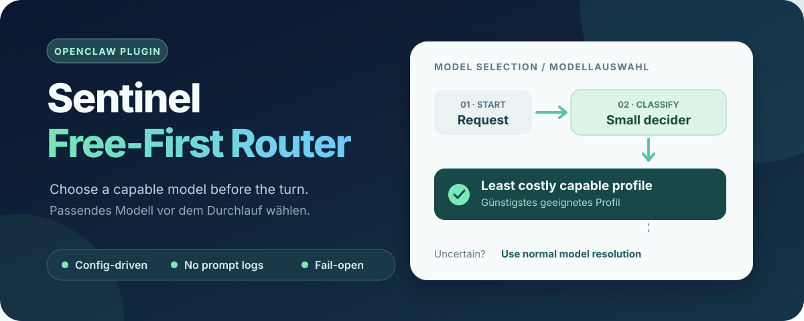

# OpenClaw Sentinel Free-First Router



[← Language selection](README.md) · [Deutsch](README.de.md)

**An installable, provider-neutral model router for OpenClaw.**

The plugin runs at `before_model_resolve`. A configured chat-completions-compatible decider classifies the current prompt into capability tiers 1–3 and returns a confidence score. The router chooses the lowest `costRank` among configured profiles that support the required tier. A profile can point to any model already configured in OpenClaw.

If the decider fails, times out, returns an invalid answer, or is uncertain, the plugin returns no override. OpenClaw then resolves the model normally. Attachments, oversized prompts, and excluded agents also keep normal model resolution.

## Install

Download the `.tgz` package from [Releases](https://github.com/lesecuritae/openclaw-sentinel-free-first-router/releases), then run:

```bash
openclaw plugins install ./openclaw-sentinel-free-first-router-0.1.0.tgz
openclaw plugins enable openclaw-sentinel-free-first-router
```

The plugin stays inactive until you configure both profiles and a decider. Non-bundled plugins need `hooks.allowConversationAccess: true` for `before_model_resolve`; review that permission because the decider receives the current prompt. See the [OpenClaw hook documentation](https://docs.openclaw.ai/plugins/hooks/prompt-and-session).

## Configure

Merge this example into your OpenClaw configuration and replace every placeholder with your own values. It contains no working provider endpoint or credential.

```json5
{
  plugins: {
    entries: {
      "openclaw-sentinel-free-first-router": {
        enabled: true,
        hooks: { allowConversationAccess: true },
        config: {
          profiles: [
            { id: "economy", provider: "your-provider", model: "your-economy-model", maxTier: 1, costRank: 0 },
            { id: "capable", provider: "your-provider", model: "your-capable-model", maxTier: 3, costRank: 20 }
          ],
          decider: {
            endpoint: "https://your-decider.example/v1/chat/completions",
            model: "your-decider-model",
            apiKeyEnv: "ROUTER_DECIDER_KEY",
            timeoutMs: 4000,
            maxPromptChars: 3000
          },
          minConfidence: 0.7,
          excludedAgents: ["pinned-agent"]
        }
      }
    }
  }
}
```

Set `ROUTER_DECIDER_KEY` in the Gateway environment, not in this repository. Omit `apiKeyEnv` only for an endpoint that requires no authentication. The endpoint must use HTTPS; plain HTTP is accepted only for loopback. Tier 1 is routine work, tier 2 moderate work, and tier 3 complex work. `costRank` is a relative order you assign, not a live price feed.

The decider must accept a chat completions request and reply with JSON text such as `{"requiredTier":1,"confidence":0.9}` in `choices[0].message.content`. The router only accepts tiers 1–3 and never uses a provider or model name from the decider response.

## Privacy and limits

- Only bounded prompt text is sent to the configured decider; prompts with attachments or more than `maxPromptChars` characters are not sent.
- Logs contain tier, profile ID and confidence, or a generic fallback reason. They do not contain prompts, response bodies, tokens or credentials.
- This plugin chooses a model before a turn. It does not retry a failed model call or enforce a spending cap.
- “Free-first” is a routing preference. Free quotas, prices and model quality can change.

## Develop

```bash
npm run build
npm test
npm run pack:check
```

## Support

The plugin is free to use. If you would like to support its continued development, Tarnkappe.info accepts voluntary Monero donations. [Donate with a Monero wallet](monero:83WjjKs4ijKChStc9GPrpZYa9DXYpHmbSeVipJrQSzMnRdmYtFE4K5D7ff7BsrTDa8TTZvJmAWivgWLEcJpULQ79KpRX8ik). Installation does not require a donation.

```text
83WjjKs4ijKChStc9GPrpZYa9DXYpHmbSeVipJrQSzMnRdmYtFE4K5D7ff7BsrTDa8TTZvJmAWivgWLEcJpULQ79KpRX8ik
```

The package ships built JavaScript in `dist/` and a native `openclaw.plugin.json` manifest. See [LICENSE](LICENSE) for the MIT license.
